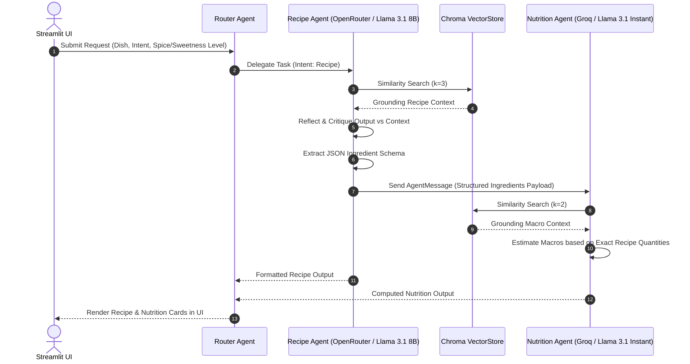

# 🍛 Sri Lankan Flavor Assistant

An Agentic AI Streamlit application that delivers Sri Lankan recipes adjusted to customized spice/sweetness levels and computes realistic nutrition profiles. Powered by a Multi-Agent Architecture, RAG over an authentic recipe corpus, self-reflection, and structured inter-agent messaging.

* **Live Demo:** [sl-flavor-agent-bydil.streamlit.app](https://sl-flavor-agent-bydil.streamlit.app/)
* **GitHub Repository:** [github.com/dilekha2001/sl-flavor-agent](https://github.com/dilekha2001/sl-flavor-agent)
* **Course:** IT41043 — Intelligent Systems (Agentic AI), Horizon Campus

---

## Architecture & Agentic Design Patterns

This system leverages **4 core agentic design patterns**:

1. **Router Pattern (`router_agent`):** Evaluates user intent (`recipe` vs `nutrition`) and dynamically delegates execution to specialized downstream agents.
2. **Reflection / Self-Correction Pattern (`reflect_on_recipe`):** After initial recipe generation, the LLM re-reads its output against retrieved ground-truth context to check for ingredient or procedural errors. If issues are found, it self-corrects before handing off to the next step.
3. **Structured Agent-to-Agent Communication (`AgentMessage`):** Rather than computing generic nutrition data via a separate lookup, `recipe_agent` extracts real ingredient quantities, formats them into a structured `@dataclass AgentMessage`, and hands it off to `nutrition_agent`.
4. **Retrieval-Augmented Generation (RAG):** Grounds LLM responses on local recipe context to prevent hallucination and improve factual consistency.

### System Execution & Communication Flow



---

## Model Selection Strategy

| Sub-task | Selected Model | Provider | Latency | Cost | Context / Reasoning Rationale |
| :--- | :--- | :--- | :--- | :--- | :--- |
| **Recipe Generation & Self-Reflection** | `meta-llama/llama-3.1-8b-instruct` | OpenRouter | ~1.2s - 1.8s | Low | Higher instruction-following quality, superior reasoning capability for self-reflection and strict JSON schema extraction. |
| **Nutrition Extraction** | `llama-3.1-8b-instant` | Groq | ~150ms - 300ms | Extremely Low / Free Tier | Optimized for near-instant execution on structured numerical extraction tasks where speed matters more than deep reasoning. |

---

## RAG Pipeline & Corpus

* **Corpus:** 22 Sri Lankan recipe `.txt` files (20 Main Dishes + 2 Desserts).
* **Embedding Model:** `sentence-transformers/all-MiniLM-L6-v2` (384 dimensions).
* **Vector Database:** Local `Chroma` instance (`./chroma_db`), cached via `@st.cache_resource`.
* **Retrieval Config:** Top-$k$ similarity search ($k=3$ for recipes, $k=2$ for nutrition grounding).

### Retrieval Quality Benchmark

| Query | Top Result(s) | Relevant? | Benchmark Notes |
| :--- | :--- | :---: | :--- |
| `spicy chicken curry` | `chicken_curry.txt` | ✅ Yes | Direct semantic match. |
| `vegetarian dish` | `fish_curry.txt`, `kottu_roti.txt` | ❌ No | False positive; corpus lacks dietary metadata tags. |
| `coconut sambol` | `pol_sambol.txt`, `milk_rice.txt` | ⚠️ Partial | Correctly retrieved `pol_sambol`, secondary match was contextually adjacent. |
| `dessert` | `watalappan.txt`, `curd_and_treacle.txt` | ✅ Yes | Clean domain match. |
| `mild curry` | `potato_curry.txt`, `pumpkin_curry.txt` | ✅ Yes | Accurate categorization. |

---

## Local Installation & Setup

1. **Clone Repository:**
   ```bash
   git clone https://github.com/dilekha2001/sl-flavor-agent.git
   cd sl-flavor-agent
   ```

2. **Setup Virtual Environment:**
   ```bash
   python -m venv venv
   # Activate:
   # Windows:
   venv\Scripts\activate
   # macOS/Linux:
   source venv/bin/activate
   ```

3. **Install Dependencies:**
   ```bash
   pip install -r requirements.txt
   ```

4. **Configure Environment Variables:**
   Create a `.env` file in the root directory:
   ```env
   GROQ_API_KEY=your_groq_api_key
   OPENROUTER_API_KEY=your_openrouter_api_key
   ```

5. **Run App:**
   ```bash
   streamlit run app.py
   ```

---

## Known Limitations & Future Work

* **Corpus Scope:** Small dataset (22 dishes); queries outside this set default to nearest-neighbor matches.
* **Dietary Tagging:** Requires metadata filtering (e.g., `is_vegetarian: true`) to resolve broad constraint queries.
* **Stateless:** Requests are independent with no persistent multi-turn chat memory.
* **API Dependencies:** Depends on external APIs (Groq and OpenRouter) staying operational.